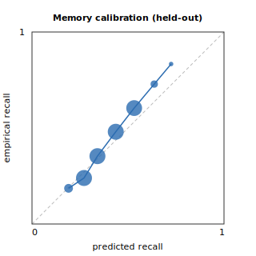

# Memory model — calibration (held-out)

Held-out **test reviews: 24265** (from 93 students never seen in training; train reviews: 79797). Reviews are simulated from a ground-truth forgetting process (not the predictor); see the module docstring for the honesty note and how to swap in real revlog data.

- **Brier score: 0.2159** (lower is better; always-guess-the-mean baseline = 0.2240)
- **Log-loss: 0.6222**
- **Expected calibration error (ECE): 0.0238**
- Base recall rate: 0.339

Reliability diagram: 

| predicted bin | mean predicted | empirical recall |     n |
| ------------- | -------------: | ---------------: | ----: |
| 0.1–0.2       |          0.190 |            0.186 |   113 |
| 0.2–0.3       |          0.271 |            0.240 |  7725 |
| 0.3–0.4       |          0.341 |            0.353 | 12797 |
| 0.4–0.5       |          0.436 |            0.481 |  3007 |
| 0.5–0.6       |          0.532 |            0.604 |   558 |
| 0.6–0.7       |          0.636 |            0.729 |    59 |
| 0.7–0.8       |          0.724 |            0.833 |     6 |

**Verdict: well-calibrated** — the model beats the always-predict-the-mean baseline (0.2159 < 0.2240) and ECE is 0.024.

> Reproduce: `out/pyenv/bin/python verify/calibration.py --out verify/artifacts/calibration.md`
